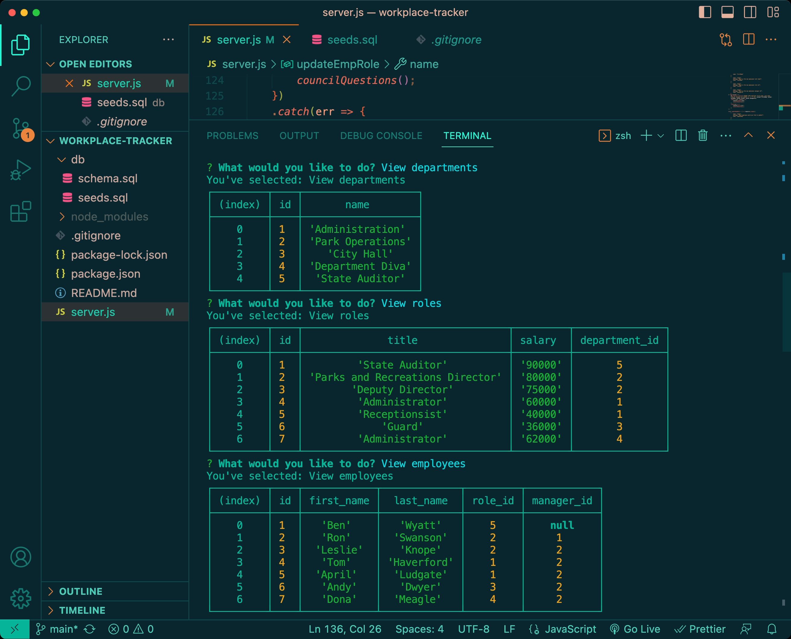
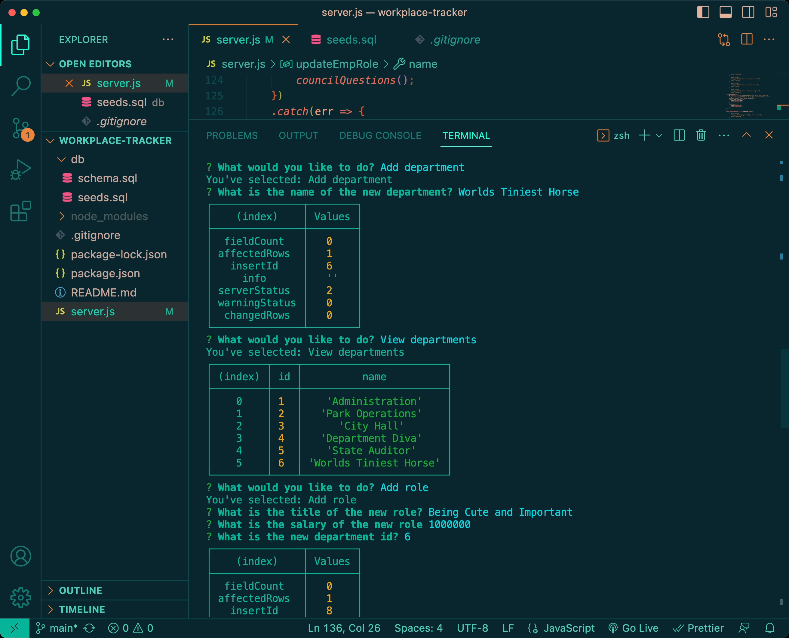
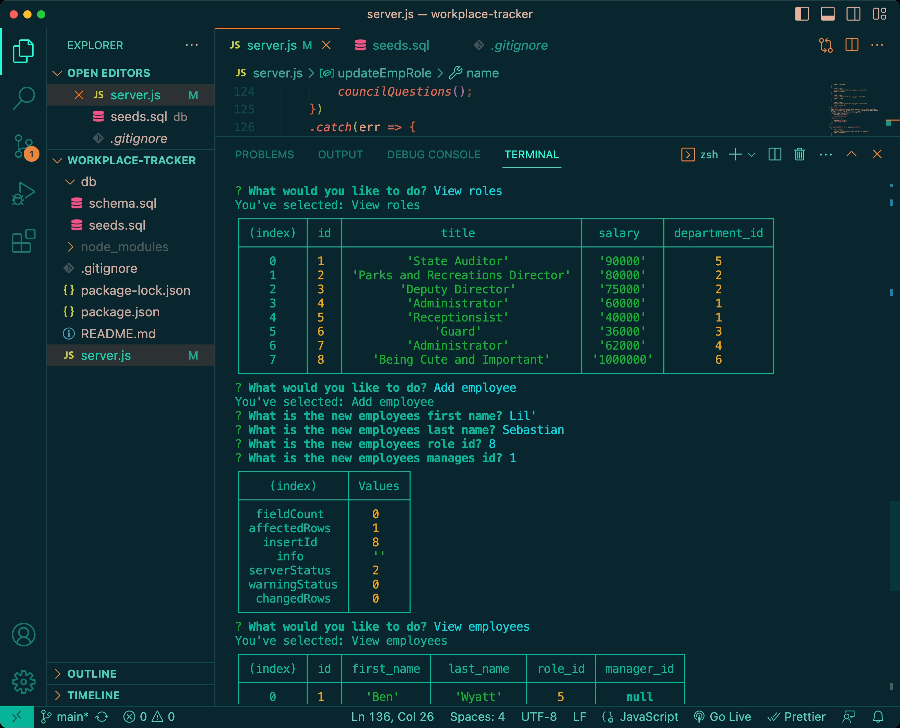
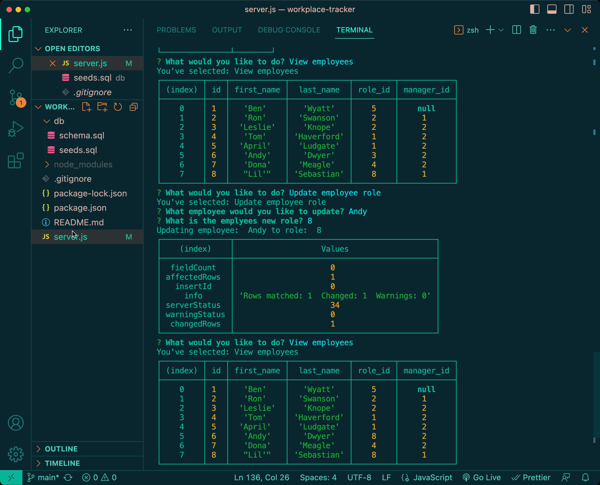

  # Workplace Tracker 

  ### Table of Contents (Optional)

  - [Description](#description)
  - [Installation](#installation)
  - [Packages](#packages)
  - [Usage](#usage)
  - [Credits](#credits)
  - [License](#license)
  - [Tests](#tests)
  - [Contact](#contact)

  ## Description
  This application will help an employer  manage their company’s employee database using Node.ja, Inquirer and MySQL.  It can be used to view, add, or update the roles of the company, different departments, and its employees. 
  ## Installation
  This application will require the following tools:
  - `Inquirer 8.2.4` 
  - `MySQL2 3.6.5`
  - `Express 4.18.2`

  ## Usage
  1. Download the repository for the application at https://github.com/H3yJ4yy/workplace-tracker, and make sure you have Visual Studio Code installed.
  2. Open the application on VS Code, and in the integrated terminal install node.js v16.
  3. Using the integrated terminal, type in `npm init -y` to initiate the application.
  4. Using the integrated termional, type `npm i inquirer@8.2.4` to install the inquirer package. Then type in `npm install --save mysql2 ` to install MySQL2. Lastly, type in `npm install express` to install Express.
  5. Once everything is installed, type in the integrated terminal `npm i` to install all of our dependencies. 
  6. Once the dependencies have been installed, run `mysql -u root -p` in the command line and type in your MySQL password. 
  7. Once you’ve accessed the databases, make sure you are in the project folder, and run `source ./db/schema.sql` 
  8. After running the schema, run `source ./db/seeds.sql` to seed your initial data into the database.
  9. After running the seeds, run `exit` to exit out of MySql. 
  10. Once back to the main terminal, run `npm start` to initiate the appplication. 
  11. Once the application is running, you will be allowed to choose from a number of commands that will allow you to modify the sitting data. 

  ## Credits
  This was done with the help of my insstructor Tyler Calverl and my private tutor Corey Yates.
  
  ## License
  none 
 
  ## Tests
  
  
  
  

  ### Contact 
  For any further questions, feel free to contact me through my GitHub [H3yJ4yy](https://github.com/H3yJ4yy) or Email [Agon0015@gmail.com](mailto:Agon0015@gmail.com).
